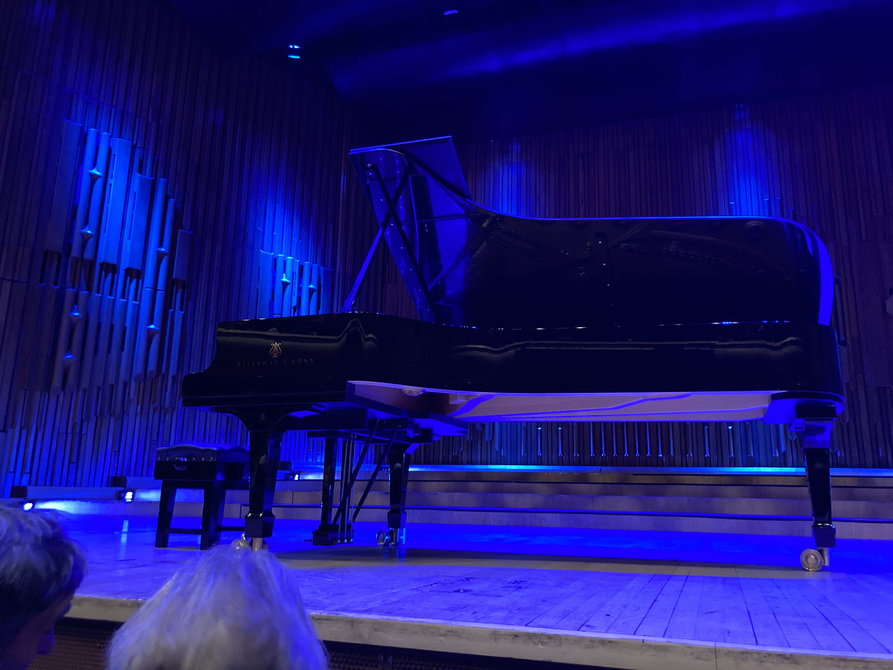

## Programme

**19:30, 24 January 2024, Barbican Centre**

Jean-Yves Thibaudet

- Debussy: Préludes, Books I and II

https://www.barbican.org.uk/whats-on/2024/event/jean-yves-thibaudet-debussy-preludes

## My thoughts

Debussy's *Preludes* were the first piece which really made me sit down and compare lots and lots of interpretations to find one I liked the most.
I've also practised a couple of them, and in particular, I really love *Les collines d'Anacapri* (No. 5 from Book I).

I don't really think I hugely enjoyed this performance, though.
It's hard to tell how much of this was because of the seat I had, and how much of it was because of the interpretations.

My favourite recording of the *Preludes* is by Paavali Jumppanen.
(I'm not just saying this because it was recommended by a popular score video channel; I've genuinely listened to a lot of interpretations on Spotify etc.)
I really enjoy the dreamy, relaxed ambience that it conjures.
Maybe that's a lazy characterisation of Debussy's music, but honestly, if I wanted loud banging music I'd go listen to Liszt or something.

<iframe width="100%" height="315" src="https://www.youtube.com/embed/UIHpca_rWUc?si=jhURwV3KjsRtwtkb" title="YouTube video player" frameborder="0" allow="accelerometer; autoplay; clipboard-write; encrypted-media; gyroscope; picture-in-picture; web-share" allowfullscreen></iframe>

This particular performance felt rather different.
That's valid, of course: everybody has a different approach to these pieces (my survey of the existing discography revealed as much).
But I felt at times it was not being held together as much, and it was often startling to hear some rougher articulations or dynamics.

Unfortunately, I was *really* close to the piano:

and I think I was getting a very raw sound from the piano.
In fact it was close enough for me to hear Thibaudet pressing the pedal.
So, I have a nagging suspicion that a different seat would have given me a slightly more blended sound which I might've preferred.

**6/10**

## Recordings

Jumppanen as mentioned above.
Though, I'd be really interested if Seong-Jin Cho recorded the *Preludes*.
