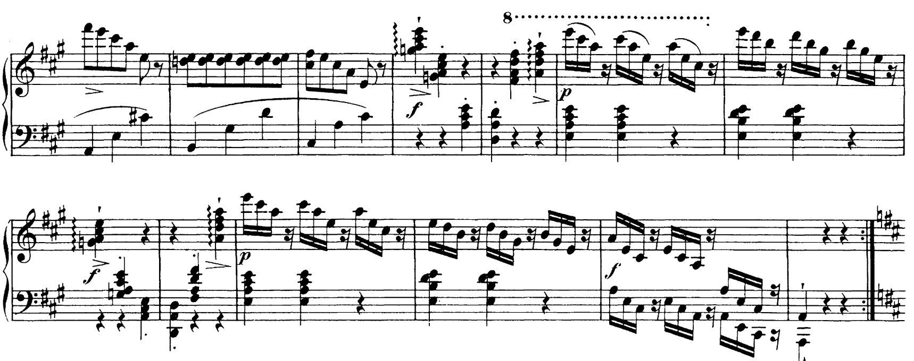
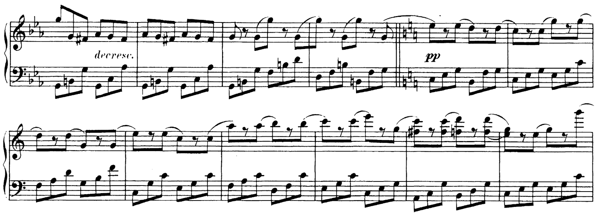
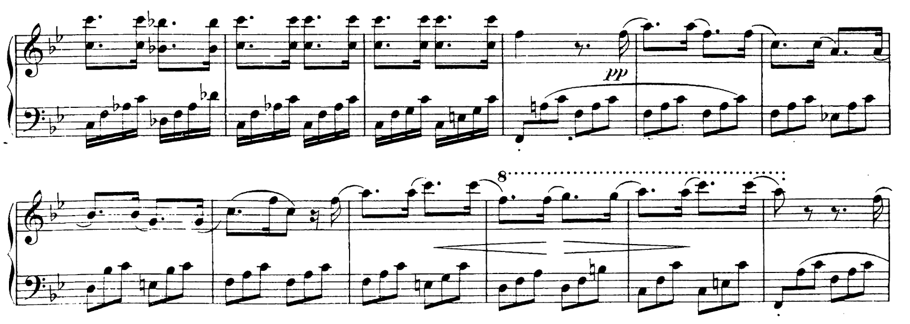
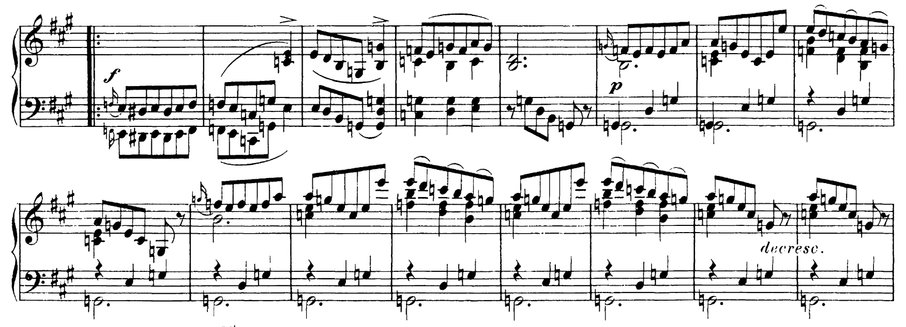

## Programme

**19:30, 24 March 2024, Wigmore Hall**

Paul Lewis piano

- Schubert: Piano Sonata No. 19 in C minor, D958
- Schubert: Piano Sonata No. 20 in A, D959
- Schubert: Piano Sonata No. 21 in B flat, D960

https://www.wigmore-hall.org.uk/whats-on/202403241930

## My thoughts

Paul Lewis is generally considered one of the best Schubert interpreters—so I couldn't help but snap up tickets for this concert featuring Schubert's last three piano sonatas.
I must confess that although I have heard these sonatas many times, I have never actively listened enough to think about details of interpretation or structure.
This is partly because these sonatas are not _easy_ listening: they are quite long, have a rather dense structure, and generally aren't the sort of piece I would put on as background music.
But I do know the melodies.

The concert started off rather bizarrely: Lewis came onto stage, started playing the C minor sonata, but stopped after a few bars because there was a buzzing noise (ostensibly from somebody's hearing aid being misconfigured).
It took several minutes for the sound to go away, at which point he restarted the programme.
(I think this was the first time I've ever been to a concert which was restarted.)

It didn't seem to faze him: the performance was assured and full of intent.
The noticeably brisk tempi provided a strong sense of forward momentum to propel the music forward.
At the same time, I didn't feel that there was a strong sense of individuality in the performance: my impression was that it was a fairly straightforward reading of the music.
I would say that some of my favourite pianists fall into this category (I'm thinking Perahia and Schiff), and I really enjoy their Bach because I can focus on the music instead of wondering what the performer's going to do next (I didn't really enjoy Barenboim's *Goldberg Variations*, for example).

But I came out of the concert wishing it was a little bit more interesting, because some of the bits where he _did_ play with the music a bit were really delicious, such as the rubato in this passage (from the third movement of D959) where he inserted the tiniest gap of silence between the descending arpeggios in the fifth bar:

And there were some very beautiful shifts in tone colour, for example, during the shift from C minor to C major in the fourth movement of D958:

as well as in the tinkling high notes in the fourth movement of D960:

And the fourth movement of D959 opened with an amazing sensation of warmth that felt almost like an embrace.

At the end of the day, I had a very hard time deciding between a score of 7 and 8, but I've eventually gone for 7 because of the very selfish reason that I was quite tired by the end of it.
As always, scores should never be taken as a mark of how good a concert, merely how much I enjoyed it!

**7/10**

## Recordings

No offerings from me here.
As I wrote above, I've listened to these pieces many times, but I've never actually _listened_ to them seriously.
Maybe now is the time to change that!

I am actually giving Lewis's studio recording a listen now and there are things in there which I am hearing that I did not really hear at the concert.
I can't quite tell how much this comes down to a differing interpretation, to very good recording acoustics, or just to execution on the day.
But I am enjoying the pedalling in this passage in the third movement of D959, particularly during the repeat where it gets a little blurry towards the end:

<iframe allow="autoplay *; encrypted-media *; fullscreen *; clipboard-write" frameborder="0" height="450" style="width:100%;max-width:660px;overflow:hidden;border-radius:10px;" sandbox="allow-forms allow-popups allow-same-origin allow-scripts allow-storage-access-by-user-activation allow-top-navigation-by-user-activation" src="https://embed.music.apple.com/gb/album/schubert-the-late-piano-sonatas/857696037"></iframe>
