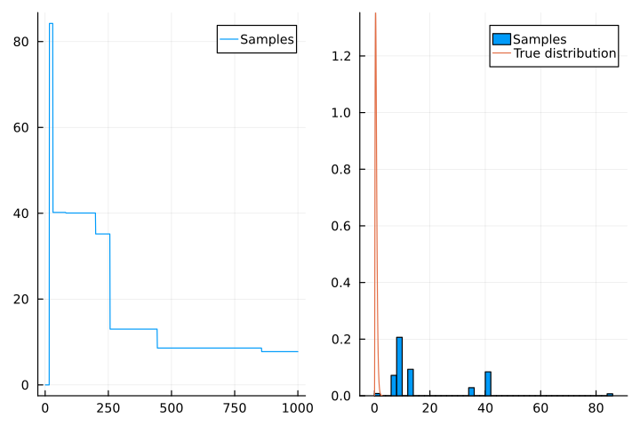
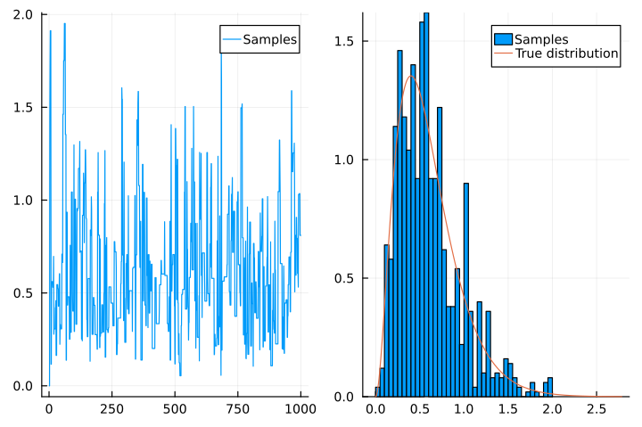

Since I'm working on Bayesian inference things, I may as well write some articles about the underlying theory to make sure I actually understand what I'm working on.

This post will talk very generally about the Metropolis–Hastings algorithm.
The presentation will be somewhat similar to that in Bishop's _Pattern Recognition and Machine Learning_ (which I abbreviate as _PRML_), and is accompanied by some Julia code to implement it.

In future posts I aim to talk about implementing these in a way that is compatible with Turing.jl, and perhaps more advanced MCMC methods.

## The need for sampling

In Bayesian inference, it's a not-uncommon scenario to have a probability distribution that is analytically intractable.
Say that $\mathcal{D}$ is some data (observations) that we want to model, and our model takes a single parameter $\theta$.
Then Bayes's theorem tells us that:

```math
p(\theta | \mathcal{D}) = \frac{p(\mathcal{D} | \theta) p(\theta)}{p(\mathcal{D})}.
\tag{1}
```

Here, $p(\theta)$ is the _prior_, which we choose ourselves; and $p(\mathcal{D} | \theta)$ is the _likelihood_, which can be calculated from the model we have chosen.
For example, if $\mathcal{D}$ is just a single number and our model says that is normally distributed with mean $\theta$ and variance 1:

```math
\mathcal{D} \sim \mathcal{N}(\theta, 1).
\tag{2}
```

then the likelihood is:

```math
p(\mathcal{D} | \theta) = \frac{1}{\sqrt{2\pi}} \exp\left[-\frac{1}{2} (\mathcal{D} - \theta)^2\right].
\tag{3}
```

The problem with this usually comes with the denominator in eq. 1, i.e. $p(\mathcal{D})$, which is called the _evidence_ or _marginal likelihood_.
To calculate this, we need to integrate (or _marginalise_) over all possible values of $\theta$:

```math
p(\mathcal{D}) = \int_{-\infty}^{\infty} p(\mathcal{D} | \theta) p(\theta) \, \mathrm{d}\theta.
\tag{4}
```

This is difficult!
For the numerator, evaluating eq. 3 and then tacking on $p(\theta)$ will give us the value of $p(\mathcal{D} | \theta) p(\theta)$ for _one_ given value of $\theta$.
We can also denote this as $p(\theta, \mathcal{D})$; it is a _joint distribution_.

But for the denominator (eq. 4), we need to evaluate this for _all_ possible values of $\theta$.
Sometimes, if a nice form for the prior is chosen (a _conjugate prior_), this integral can be solved analytically.
In this case, the conjugate prior is itself a normal distribution (see e.g. *PRML*, §2.3.6).
Usually, you can't.[^normalisation]

[^normalisation]: As someone with a quantum mechanics background, this denominator looks awfully like a normalisation constant.
Indeed, it is: it's there to make sure that the posterior distribution integrates to 1 over all space.
But can't we just ignore it?
We do that all the time in physics!
Well, the problem is that we actually _do_ want to know the exact value of the posterior distribution for each value of $\theta$.
For example, maybe we'd like to know the probability that $\theta$ lies within a range.
To do so, we have to integrate the posterior distribution over that range.
Often in physics or chemistry, we only care about whether the integral is 0 or not (in which case the normalisation constant doesn't matter), or we're trying to find a ratio of two integrals (in which case it cancels out).

Instead of trying to find a closed form for this integral, what we can do instead is to directly sample from the posterior distribution.
That is, we generate many samples of $\theta$ which are distributed according to $p(\theta|\mathcal{D})$.

## Sampling

How does this work, given that we don't actually know $p(\theta|\mathcal{D})$?
This is where a sampling algorithm comes in.
The role of a sampling algorithm is to generate a number of samples of some random variable $x$ that are distributed according to some target distribution $p(x)$
(In our case, this means sampling $\theta$ from the posterior.)

_Monte Carlo_ methods are those which use random sampling as an approximation technique.
Of course, it is impossible to reconstruct a full continuous probability distribution from a finite number of samples.
However, we are often not really interested in the shape of a full distribution, but rather some kind of expectation value.
For example, we might want to know the mean of some function $f(x)$, i.e.,

```math
E[f(x)] = \int f(x) p(x) \, \mathrm{d}x.
\tag{5}
```

In this case, if we have $N$ samples $\{x^{(1)}, x^{(2)}, \ldots, x^{(N)}\}$ drawn from the distribution $p(x)$, then we can approximate this expectation value as

```math
\frac{1}{N} \sum_{i=1}^N f(x^{(i)}).
\tag{6}
```

In other words, we apply $f$ to each sample and take the mean of the values.
One can show that this is an _unbiased_ estimator of $E[f(x)]$, in that if we draw a finite number of samples and evaluate the mean of $f(x)$, it will not necessarily be equal to $E[f(x)]$ (for example, you might be very unlucky and draw values of $x$ that are clustered around each other).
However, the expectation value of this over all possible samples is equal to $E[f(x)]$.

So, as long as we have a way of generating samples, we can obtain any expectation value we want.
Crucially, sampling methods do this without knowledge of the full distribution $p(x)$; they generate samples _only_ by evaluating the value of some other function that is proportional to $p(x)$, let's say $\tilde{p}(x)$, such that $\tilde{p}(x) = kp(x)$ for all $x$ and some $k$.
(In our case, $\tilde{p}(x)$ is the numerator in eq. 1.)

There are a number of ways to do this (see *PRML* §11 for an overview); here we focus only on **Markov chain Monte Carlo** (MCMC) methods.
A _Markov chain_ is a sequential series of samples, where the $(i+1)$-th sample $x^{(i+1)}$ is generated based on the $i$-th sample $x^{(i)}$ as well as the value of $\tilde{p}(x)$.
The defining feature of a Markov chain is that this _transition_, from $x^{(i)}$ to $x^{(i+1)}$, is independent of all samples prior to $x^{(i)}$.[^markov]

[^markov]: Technically, this is a _first-order_ Markov chain. An $n$-th order Markov chain would depend on the $n$ latest samples.

## Problem setup

Let's start by saying that we want to sample from a [gamma distribution](https://en.wikipedia.org/wiki/Gamma_distribution) with shape parameter $\alpha = 3$ and rate parameter $\beta = 5$:

```math
p(x) = \begin{cases}
\frac{5^3}{\Gamma(2)} x^2 \exp(-5x) & x \geq 0, \\
0 & \text{otherwise}.
\end{cases}
\tag{7}
```

As a motivating example, let's say we want to evaluate $E[x^2]$.
Wikipedia helpfully tells us that the variance of a gamma distribution is $\alpha/\beta^2 = 3/5^2 = 3/25$, and the mean is $\alpha/\beta = 3/5$.
So, we should expect that:

```math
E[x^2] = \text{Var}[x] + (E[x])^2 = \frac{3}{25} + \left(\frac{3}{5}\right)^2 = 0.48.
\tag{8}
```

As a sanity check, let's just directly use the samplers in Distributions.jl.
(Note that Distributions [doesn't actually use MCMC sampling for the gamma distribution.](https://github.com/JuliaStats/Distributions.jl/blob/13029c03fa885a2b4512b954e61f9d5a7dfa0612/src/samplers/gamma.jl))

```julia
using Distributions

function E_x2(N_samples)
    x = rand(Gamma(3, 1/5), N_samples)
    return mean(x.^2)
end

E_x2(1000)
```

```
0.48508303565802274
```

## Metropolis–Hastings

The simplest MCMC method is the _Metropolis–Hastings_ (MH) algorithm, so we will specifically look at this here, and implement it from scratch in Julia.

To prove that we don't need the normalising constant to get the right results, let's implement $\tilde{p}(x)$ as the gamma distribution but without the normalising constant:

```math
\tilde{p}(x) = \begin{cases}
x^2 \exp(-5x). & x \geq 0, \\
0 & \text{otherwise}.
\end{cases}
\tag{9}
```

```julia
function ptilde(x)
    return x >= 0 ? x^2 * exp(-5x) : 0
end
```

The first step of MH is to generate the first sample $x^{(1)}$.
If we have some information about the distribution of $x$ (e.g. the Bayesian prior), then we could sample from this as a starting point; however, in this case, we don't have anything, so let's arbitrarily start at 0.
(In fact, this is hardly the best place to start, because $p(0) = 0$, but it won't matter too much.)

The next part is to generate a transition.
This is done by sampling from a _proposal distribution_, $q(x)$.
Usually, the proposal distribution is not static; it moves depending on the value of the previous sample, which we can denote as $q(x|x^{(i)})$.

Hold on: this seems like a chicken-and-egg problem.
We need to sample from a distribution $q(x)$ in order to sample from our original distribution $p(x)$!
As it turns out, there are a number of simple distributions that we _already_ know how to sample from, without having to resort to Monte Carlo methods.
For example, a uniform distribution is easy to sample from: just pick a number.[^uniform]
A normal distribution can also be sampled from using techniques like the [Box–Muller transform](ihttps://en.wikipedia.org/wiki/Box%E2%80%93Muller_transform).

[^uniform]: Well, it's easy for a _human_, at least. If you're interested in how a _computer_ samples from a uniform distribution, that's another question (Knuth has a whole chapter on it in _The Art of Computer Programming_, vol. 2), but for today we'll assume that we're already given a function to do that.

So, let's choose a normal distribution centred on $x^{(i)}$ as our proposal distribution.
We're going to keep the variance as a parameter that can be chosen; we'll explore the impact of this parameter later.

```math
q(x|x^{(i)}) = \mathcal{N}(x; x^{(i)}, \sigma^2)
\tag{10}
```

```julia
function q(x, x_i; σ)
    return exp(-0.5 * (x - x_i)^2 / σ^2) / sqrt(2π * σ^2)
end
```

To sample from this, we can use [`Base.randn`](https://docs.julialang.org/en/v1/stdlib/Random/#Base.randn), which returns a sample from $\mathcal{N}(0, 1)$.
To get a sample from $\mathcal{N}(x^{(i)}, \sigma^2)$, we just multiply the sampled value by $\sigma$ and add on $x^{(i)}$.

```julia
function sample_q(x_i; σ)
    return randn() * σ + x_i
end
```

Sampling from $q$ gives us a new proposed value of $x$, which we denote as $x^\star$.
This proposal is not always accepted; sometimes, we will _reject_ it and set $x^{(i+1)}$ to just be the same value as $x^{(i)}$.
In the MH algorithm, the probability of accepting the new value is given by

```math
A(x^\star | x^{(i)}) = \min\left(1,
\frac{\tilde{p}(x^\star) q(x^{(i)} | x^\star)}{\tilde{p}(x^{(i)}) q(x^\star | x^{(i)})}
\right)
\tag{11}
```

In this specific instance, our proposal distribution is _symmetric_ in that $q(x^{(i)} | x^\star) = q(x^\star | x^{(i)})$ (or in code, `q(x, x_i) = q(x_i, x)` for all pairs of arguments).
So, this simplifies to

```math
A(x^\star | x^{(i)}) = \min\left(1,
\frac{\tilde{p}(x^\star)}{\tilde{p}(x^{(i)})}
\right)
\tag{12}
```

```julia
function A(x, x_i)
    return min(1, ptilde(x) / ptilde(x_i))
end
```

(The case of a symmetric proposal is sometimes called just the _Metropolis algorithm_.)

To decide whether to accept or reject this, we generate a random number between 0 and 1.
If the random number is larger than $A(x^\star | x^{(i)})$, we reject the proposal.

```julia
function accept(x, x_i)
    return rand(Float64) < A(x, x_i)
end
```

Putting this all together, this lets us fill in the remaining samples.
Let's set the variance as $\sigma^2 = 1$ for now.

```julia
function sample(; σ)
    samples = zeros(Float64, 1000)
    samples[1] = 0

    for i in 2:length(samples)
        # x_i is the previous sample
        x_i = samples[i-1]
        # Sample from the proposal distribution
        x_star = sample_q(x_i; σ=σ)
        # Accept or reject the proposal
        samples[i] = accept(x_star, x_i) ? x_star : x_i
    end

    return samples
end
```

And we can then evaluate $E[x^2]$.
Remember, we are expecting a value of 0.48.

```julia
using Statistics: mean
samples = sample(σ=1)
mean(samples .^ 2)
```

```
0.4956993692676729
```

Okay, not too bad!
If you ran this code yourself, you might find that the value is less or more accurate.
This is because 1000 samples isn't really a lot; if we increase the number of samples to, say, 100000, you should obtain results that are much closer to the expected 0.48.

## The variance

So far, we have explicitly made the variance a parameter that we can tune.
Let's see what happens if we choose a very small value for $\sigma^2$.

```julia
samples_small = sample(σ=0.001)
mean(samples_small .^ 2)
```

```
0.0012259461216478714
```

Not quite right.
What gives?
Well, $\sigma^2$ being very small makes the proposal distribution very narrow.
This means that it is very difficult for the algorithm to explore a wide enough range of values for $x$, with the 1000 steps that we gave it.
To show this, we can plot two things: firstly, how the sampled values change over time, and secondly, a histogram to show their distribution.
The latter can also be compared with the true underlying distribution:

```julia
using Plots
using StatsPlots
using Distributions

function plot_samples(xs)
    p1 = plot(xs, label="Samples")
    p2 = histogram(xs, bins=50; normed=true, label="Samples")
    plot!(p2, Gamma(3, 1/5), label="True distribution")
    plot(p1, p2, layout=(1, 2))
end

plot_samples(samples_small)
```


Clearly, all the sampled values are all clustered around 0.
If we had taken more samples, we would eventually have crawled our way up to larger values, but this is very inefficient.

Conversely, what happens if we choose a very large value for $\sigma^2$?

```julia
samples_big = sample(σ=1000)
mean(samples_big .^ 2)
```

```
512.282811923675
```

Oops.
Let's plot the samples again:

```julia
plot_samples(samples_big)
```



This time, clearly we have managed to take a step away from 0.
However, as the very flat lines on the left plot indicate, we haven't actually sampled very many values either.
This is because the proposal distribution is very wide: consequently, it's likely that $x^\star$ is far away from $x^{(i)}$, which leads to a very small acceptance probability.
In other words, most of our steps are being rejected.
Again, this can be solved by taking more samples (so that we eventually get enough accepted steps), but it is just as inefficient as before.

Let's return again to our standard deviation of 1 and see how closely the samples match the true distribution.

```julia
plot_samples(samples)
```



While it doesn't match _perfectly_, it at least has the correct scale and approximate shape, which is why it gives us a reasonable answer for $E[x^2]$ even with just 1000 samples.
In general, we want the width of the proposal distribution to be on the same scale as the width of the target distribution.
Obviously, this is not always easy to know in advance!
This becomes even more complicated for multivariate distributions as the width in different dimensions may not be similar.


## Why does this work?

The above example shows that, at least if you choose a good proposal distribution, the MH algorithm empirically gives correct results.
But how can we be certain that this is always true, i.e., how can we mathematically prove that the samples drawn _do_ obey the target distribution (at least in the limit of infinite samples)?
Or equally, how do we know that the estimator is truly unbiased?
(These questions are equivalent, because if the samples do obey the target distribution, then the estimator is unbiased.)

The exact details are not fully covered even in *PRML*, but the key notion here is that this Markov chain is constructed in such a way to be _ergodic_.
Namely:

1. The target distribution we are trying to sample from, $p(x)$, is _invariant_ under the Markov chain, meaning that if the $i$-th sample obeys the target distribution, then the $(i+1)$-th sample will also.
2. Regardless of what probability distribution we begin with for the first sample, the distribution of the $i$-th sample will converge to the target distribution as $i \to \infty$.

The first point relies on a condition called _detailed balance_, which states that for all $x$ and $x'$,

```math
p(x) T(x'|x) = p(x') T(x|x'),
\tag{13}
```

where $p(x)$ is the target distribution (which we are trying to show is invariant), and $T(x'|x)$ is the probability of transitioning from $x$ to $x'$, also called a _transition kernel_.
Suppose that this condition holds true, and the $i$-th sample, $x^{(i)}$, obeys the target distribution.
Then the distribution of the $(i+1)$-th sample (let's give it the symbol $p_?$, because we haven't actually shown that it obeys the target distribution) is

```math
\begin{align}
p_?(x^{(i+1)}) &= \int T(x^{(i+1)} | x^{(i)}) p(x^{(i)}) \, \mathrm{d}x^{(i)} \\
&= \int T(x^{(i)} | x^{(i+1)}) p(x^{(i+1)}) \, \mathrm{d}x^{(i)} \\
&= p(x^{(i+1)}) \int T(x^{(i)} | x^{(i+1)}) \, \mathrm{d}x^{(i)} \\
&= p(x^{(i+1)}),
\end{align}
```

as desired.

First notice that if $x' = x$, then detailed balance trivially holds true.
So we can focus on the case where $x' \neq x$.
In this case, the transition probability is

```math
T(x'|x) = q(x'|x)A(x', x),
\tag{14}
```

i.e., the probability of choosing that new proposed value $x'$ multiplied by the probability of accepting it.
Substituting this into eq. 13, along with the more general definition of $A$ from eq. 11, we have that

```math
\begin{align}
p(x)T(x'|x) &= p(x)q(x'|x) \min \left(1, \frac{\tilde{p}(x') q(x|x')}{\tilde{p}(x) q(x'|x)} \right) \\[0.2cm]
&= p(x)q(x'|x) \min \left(1, \frac{p(x') q(x|x')}{p(x) q(x'|x)} \right) \\[0.2cm]
&= \min \left(p(x)q(x'|x), p(x') q(x|x') \right), \\
\end{align}
```

and likewise

```math
p(x')T(x|x') = \min \left(p(x')q(x|x'), p(x) q(x'|x) \right).
```

The minimum function is symmetric in its arguments: $\min(a,b) = \min(b,a)$, so these two expressions are equal, and detailed balance holds.
Note that this is only true because of the specific form of the acceptance criterion that the MH algorithm specifies.
Collectively, this proves that as long as we have reached the distribution $p(x)$ at some point, successive samples from the Markov chain will continue to have the same distribution.

It doesn't show that the Markov chain will _converge_ to the target distribution, but _PRML_ omits this proof, so I'm stuck.
I think it does this because the proof is rather involved; a Google search for "ergodicity of Metropolis–Hastings" turns up a number of _very_ mathematical papers which I'm not quite ready for.
In other words, this proof is left as an exercise for the reader.

In the [next instalment of this series](/posts/2024-08-22-mcmc2), we'll look at applying the MH algorithm to an actual inference problem.

## The code, in full

For convenience, the Julia code used in this blog post is [on GitHub](https://github.com/penelopeysm/penelopeysm.github.io/blob/main/src/content/posts/2024-08-19-mcmc1/code.jl).
