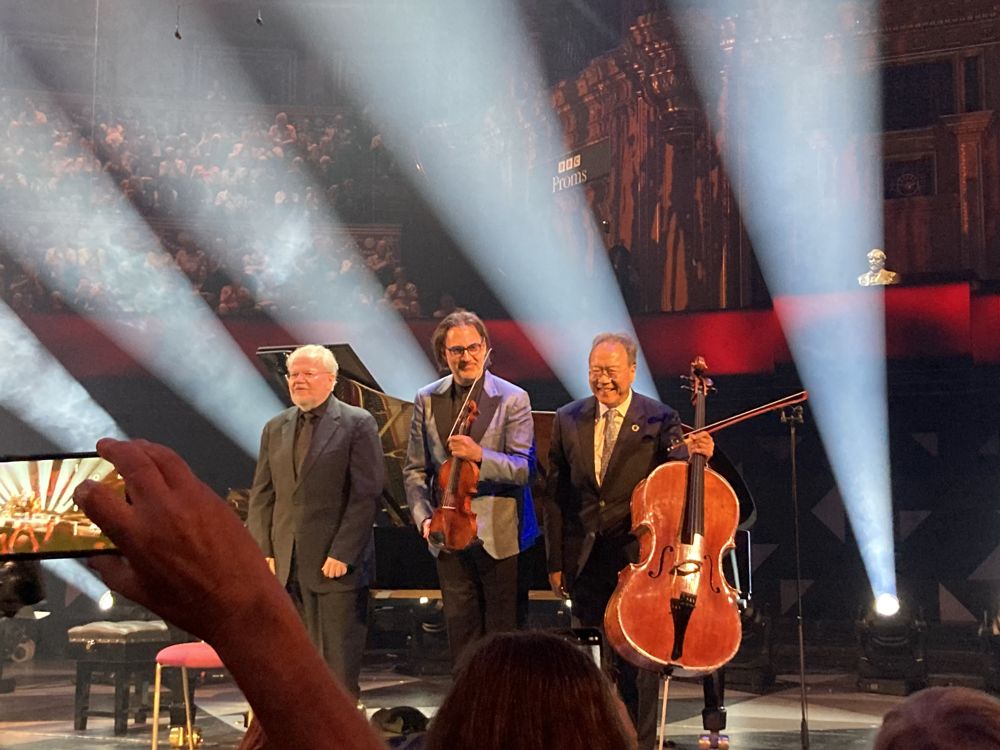

## Programme

**16:00, 31 August 2024, Royal Albert Hall**

Leonidas Kavakos violin 
Yo-Yo Ma cello 
Emanuel Ax piano 

- Brahms: Piano Trio No. 2 in C, Op. 87
- Beethoven: Piano Trio No. 9 in B flat 'Archduke', Op. 97

https://www.bbc.co.uk/events/e4fcd4

----------

Promming tickets sold out extremely quickly; I was lucky to be at the RAH in person the morning before to get physical tickets.
(Somehow, despite the Arena tickets being sold out online, the Box Office staff were still able to print out two tickets for me; this leads me to suspect that they reserve a certain number of tickets for in-person sales.
Of course, I have no proof of this, but it seems like an easy enough thing for them to do since they can see how many people are queueing for tickets.)

On the day itself, I had turned up at 9:10 am to get a queue number, and there had already been almost 200 people before me.
(To be fair, the queue numbers were shared between this Prom and the next, both of which were very popular.
I've written separately about the Prom after this, which was [Vikingur Ólaffson and the Berlin Phil](/posts/2024-08-31-prom55).)

With such a star-studded lineup, expectations were no doubt at an all-time high.
Of the three, Yo-Yo Ma is probably the biggest sensation (I feel it was slightly unfair that most people were calling this the 'Yo-Yo Ma Prom'), and it was my first time seeing him—I'd previously seen Ax at the Proms (back in 2019, playing Beethoven 4) and Kavakos in Oxford.

While I definitely _enjoyed_ it, though, I don't feel like I was quite blown away.
Part of this is the repertoire: I suppose that in trios / quartets / etc. the performers don't individually stand out as much, and so individual playing doesn't matter so much.

Part of it was the playing, too, though.
While it was very beautiful and understated playing, without anybody trying very hard to be in the limelight, I felt it sometimes leaned a little bit _too_ much in that direction; almost to the point of langour.
This meditativeness and measuredness worked very nicely in some parts of the repertoire, such as the serene opening of the Beethoven, and perhaps especially so in the first encore, the second movement of Schubert's B flat Trio.
Yet I don't feel like the Brahms, or the Scherzo of the Beethoven ever really took off.
The Beethoven wasn't particularly helped by some less-than-perfect intonation.

What I did find somewhat fascinating is Kavakos's playing.
He somehow has a way of making it look like the vioin bow is really light—as a violinist, I can assure the reader that this is not true—especially when you are holding it close to the frog (i.e. the part of the bow that is held).
I don't entirely know how he does it.

Anyway, I don't at all regret that I went, nor do I think it was bad!
I do think though that over the course of this year I've learnt to not hype myself up for specific concerts too much—just take it as it comes.
