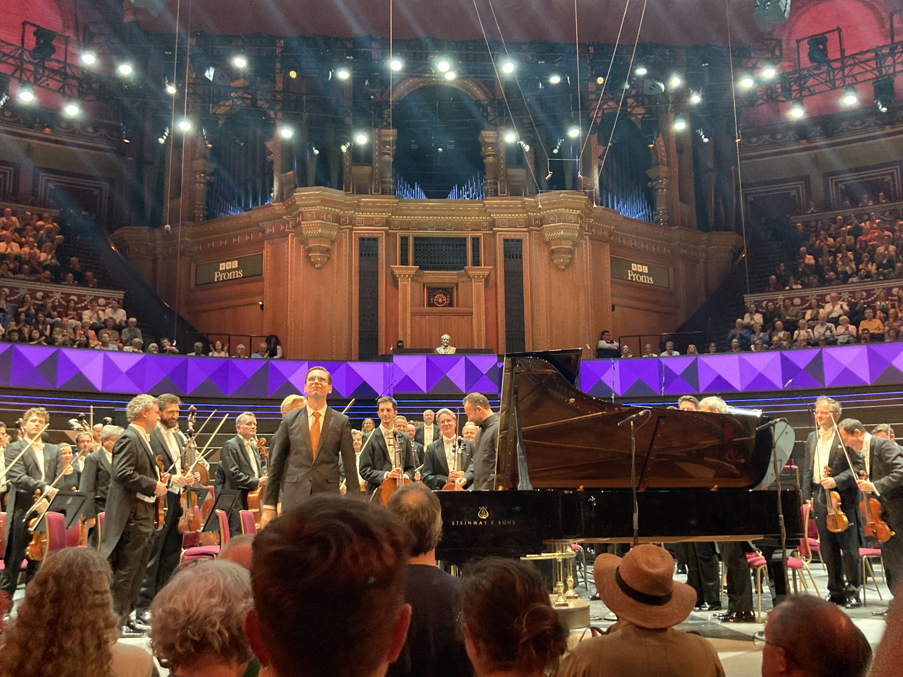
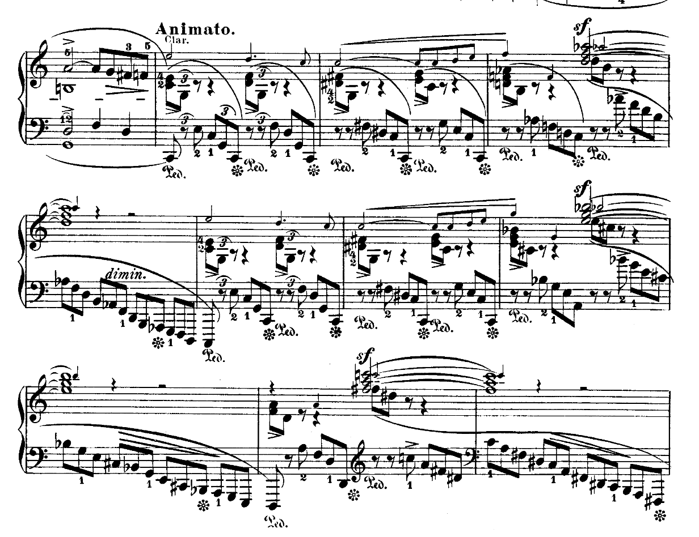

## Programme

**20:00, 31 August 2024, Royal Albert Hall**

Vikingur Ólafsson piano 
Kirill Petrenko conductor 
Berlin Philharmonic 

- Schumann: Piano Concerto
- Smetana: Má vlast

https://www.bbc.co.uk/events/e9r5q9

------------

Ooh, now _this_ one was good.
It was part of a two-Prom day, following on from [Yo-Yo Ma, Leonidas Kavakos, and Emanuel Ax playing piano trios](/posts/2024-08-31-prom54).

I heard Ólafsson at the Royal Festival Hall playing the Goldberg Variations last year, and while I wasn't sold on every single interpretative choice, I thought it was a really impressive outing.
In my opinion, he is clearly going to be one of the foremost pianists of the future (if he isn't already one).
He has a huge range of tone colours, and uses it brilliantly to make music sound fresh without being bizarre.

(By the way, he [lived in a flat above Gloucester Green for three years](https://www.theguardian.com/music/2019/apr/30/pianist-vikingur-olafsson-interview-bach), which I think was around 2010—so before I started at Oxford—but ... if I ran into him somewhere, we'd have something to talk about!)

This Schumann performance was brilliant as well; it was very controlled and not impetuous in the way, for example, Argerich is (I remember her playing Schumann with the Oxford Phil a few years back).
I enjoyed the way in which he played these left-hand runs in the first movement slightly detached, which meant that you could hear all the notes instead of them smushing into a single phrase:

The latter is maybe good at conveying the direction of the music in broad strokes, but I found that I got the same effect just from hearing the notes, because the last three or four notes of these runs in particular tell you which key it's going to end up in.
It's a more analytical approach, for sure, but I quite like it.
I think this slightly clearer articulation is a hallmark of Ólafsson's playing; you can hear similar effects in his playing of, for example, Bach, and it's slightly reminiscent of Glenn Gould (who took it to extremes—see his recording of the WTC1 C major Prelude...) or this recording of the English Suites by Ivo Pogorelich.

<iframe allow="autoplay *; encrypted-media *; fullscreen *; clipboard-write" frameborder="0" height="175" style="width:100%;max-width:660px;overflow:hidden;border-radius:10px;" sandbox="allow-forms allow-popups allow-same-origin allow-scripts allow-storage-access-by-user-activation allow-top-navigation-by-user-activation" src="https://embed.music.apple.com/gb/album/english-suite-no-2-in-a-minor-bwv-807-1-prelude/1452167957?i=1452168164"></iframe>

Ólafsson's encore was an arrangement of the Adagio from Bach's Organ Sonata No. 4; I later discovered this was part of his award-winning Bach album from 2018.
This allowed him to show off his very wide dynamic range; the piece started as a whisper which drew the entire hall in, and then slowly built up to an almost monolithic sound.

<iframe allow="autoplay *; encrypted-media *; fullscreen *; clipboard-write" frameborder="0" height="175" style="width:100%;max-width:660px;overflow:hidden;border-radius:10px;" sandbox="allow-forms allow-popups allow-same-origin allow-scripts allow-storage-access-by-user-activation allow-top-navigation-by-user-activation" src="https://embed.music.apple.com/gb/album/organ-sonata-no-4-bwv-528-ii-andante-adagio-transcr/1410551592?i=1410552329"></iframe>

As for the Berlin Phil, this was the first time I've heard them, and they were _so_ good, as one might expect from one of the world's best orchestras.
The accompaniment for the Schumann was purposeful; they grabbed the tutti sections by the horns (proverbially... not the French horns!), and it felt like they were equal partners in the music-making with the soloist.

_Má vlast_ was likewise executed with aplomb.
It's very rare to hear the entire piece be performed in concert, but in this concert we were graced with the entire 75 minutes of it, and it was so well-done; the ensemble playing was better than anything I've ever heard, and the vastness of sounds that they conjured were genuinely impressive.
Petrenko's conducting was a joy to watch, too; he was clearly enjoying himself, but there was also a wordless continual dialogue with the musicians under his baton, communicated with very precise hand movements.

Of course, it helps to have an almost-front-row position, but I think this is possibly the best orchestral performance I have ever seen.
I think 'purposeful' is the best adjective here; I feel like they set out to make a statement, rather than just to play the right notes.
