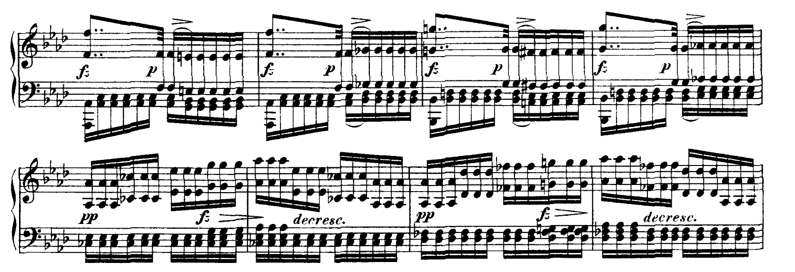
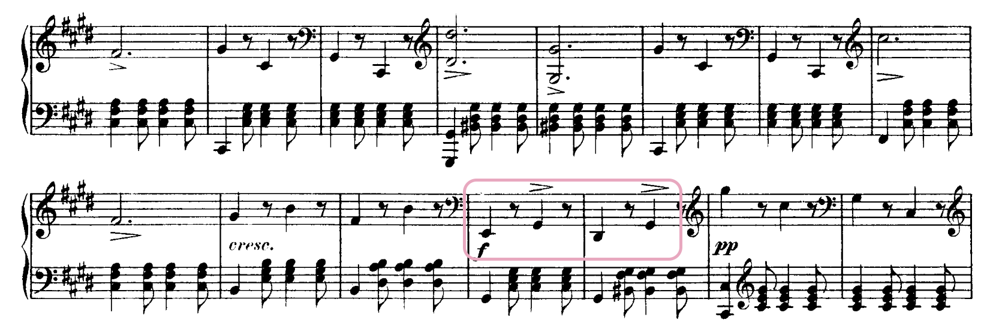
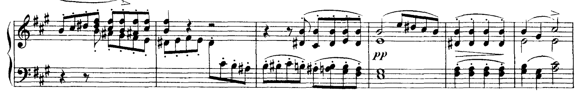
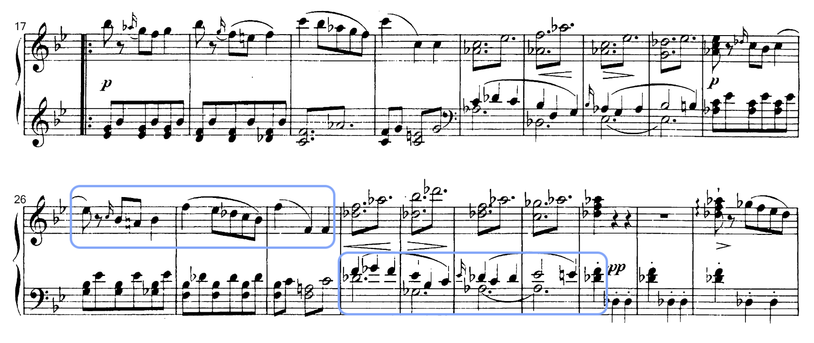

## Programme

**19:30, 29 September 2024, Wigmore Hall**

Elisabeth Leonskaja piano

- Schubert: Piano Sonata No. 19 in C minor, D958
- Schubert: Piano Sonata No. 20 in A, D959
- Schubert: Piano Sonata No. 21 in B flat, D960

https://www.wigmore-hall.org.uk/whats-on/202409291930

## My thoughts

This is the second time this year I've heard Schubert's last three sonatas at Wigmore Hall; the last time was by [Paul Lewis](../../posts/2024-03-24-lewis-schubert).
I think there is some risk in listening to the same repertoire twice, because I inevitably start to compare the current performance against the previous one, and I get disappointed when something isn't executed in a way that I liked, etc.
In fact, I already struggle with this when listening to live music – I always compare it against a recording.
So this evening's concert was really an effort for me to try to _not_ do that.

Still, I'm going to start off by setting this _against_ Lewis's rendition.
Leonskaja's playing was more lush, less refined; in a way, more Romantic, less Classical.
She used the pedal more liberally, leading to more blurred textures; I felt that generally the entire performance was weightier.
Of course, I don't think that this is better or worse, it's just interpretative.
I feel like I might prefer to listen to Lewis when I'm sitting at home just because I tend to like very precise performances (Ólafsson is the most recent example of this, I think), but when I wrote about his concert I sort of lamented that these sonatas were really long, and I think maybe Leonskaja gave me slightly more to latch onto as a listener.

(Mind you, I still do find the sonatas very long, and I did daydream a fair bit.
But at least I didn't doze off... though I suppose waking up at 12pm does help with that.)

Anyway, moving on to specific bits of the performance that I liked...

The second movement of D958 had some very nice mixed textures in this passage – the *fz* pedalled and the rest played more detached.
Also, Leonskaja very carefully kept the *pp* in the beginning of the 5th and 7th bars below (I feel that it's easy to over-emphasise the harmonic changes).

The fourth movement of D958 was slower than I had expected, but this gave the dotted rhythms in the middle more of a groove, and there was a particular swagger in the highlighted bar below.
It felt like something I could dance along to (I guess it _is_ supposed to be a tarantella):

D959 first movement was probably where I daydreamed the most, actually, but I enjoyed Leonskaja lingering on the first note of the second theme (the B minim below).
I felt like it was just a nice way to really ground the listener after the 'heroic' beginning – like saying 'it's okay, take a deep breath, we'll be fine'.

Finally, the third movement of D960 had some very delicate phrasing; the handover from the right hand to the left hand (blue boxes below) was seamless, with the RH melody almost melting into the LH.
I don't really know how else to describe it except that it was as smooth as butter.
With many recordings you very clearly hear the four-bar structure.

That's pretty much it from me this time round, I think.
Oh, there was an encore which was really slightly weird.
The Internet tells me it's Schoenberg's Six Little Piano Pieces, Op. 19, which is probably why I think it was weird.
(I'm not sure if I'll ever come around to liking that sort of thing – maybe one day, who knows.)
And then the Wigmore Hall's director came on stage to give her the Wigmore Medal, which apparently can only be held by 20 living people at any point in time.
So lots of clapping all round.
(If you're curious, [here are the other winners](https://www.wigmore-hall.org.uk/about-us/history/the-wigmore-hall-medal).)
