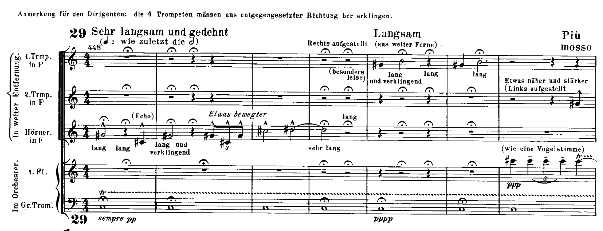

## Programme

**19:00, 23 October 2024, Barbican Hall**

Michael Tilson Thomas, conductor 
Siobhan Stagg, soprano 
Alice Coote, mezzo-soprano 
London Symphony Chorus 
London Symphony Orchestra

- Mahler: Symphony No. 2

https://www.lso.co.uk/whats-on/mahler-2-resurrection-23-oct-24/

----------

Michael Tilson Thomas's health condition is very well-known, so I won't go on about it in this post, except to mention that he seemed much more sprightly than the last time he conducted the LSO in Mahler 3 back in May.

Many people would characterise MTT's Mahler interpretations as less romantic, perhaps more controlled.
Both his Mahler 3 and today's Mahler 2 lived up to this reputation.
I feel like instead of focusing on the big picture, he pays very close attention to individual phrases and sections, and then builds up from there.
(I sense that there's a parallel to functional programming and composability somewhere in there.)

To be honest, even though I prefer Bernstein-esque passion in my Mahler, it's hard to go for a performance of Mahler 2 and _not_ be somehow moved by it.
There are so many beautiful sections dotted throughout the symphony, and the LSO conjured some very magical moments, especially in the woodwind solos, but also the percussion.
The audience was surprisingly compliant, and in the quieter sections of the fifth movement you could almost hear a pin drop: for example, in this passage with the offstage horn, I could hear (and to some extent, _feel_) the bass drum roll, which is super easy to lose in a recording:

See e.g. this Rattle/BPO recording on YouTube: https://youtu.be/-lDK2LLB6Qg?t=4259
I can just about make it out if I turn my volume to the maximum, but it's not the sort of thing I would have ordinarily picked up.
(For some reason, I can't embed the video, and I can't seem to embed _any_ YouTube performance of Mahler 2 because they're apparently all blocked content.)

I should also mention the last time I heard Mahler 2 in concert (in fact, my first time – my Mahler phase is fairly recent!).
That was in the Royal Festival Hall with the LPO and Edward Gardner in September 2023.
I think that the feature I enjoyed most of that performance was mezzo-soprano Beth Taylor.
There's actually [a video of her performance of _Urlicht_ that night](https://www.youtube.com/watch?v=h21uSxLVwKI), which again I can't embed, but I love her vocal timbre so much; it's deeper and I feel like it kind of envelopes you.
The RFH also has one other advantage over the Barbican: it has an actual organ...
