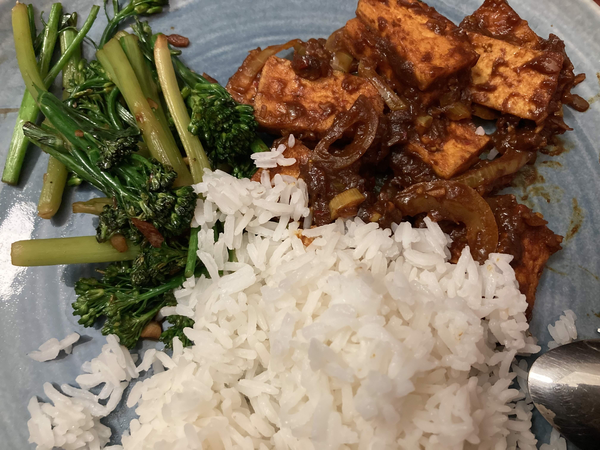

As anyone who has read the front page will know, I started a new job at Jane Street!
There's a lot that could be said about that, but I wanted to write specifically about cooking meals.

In my previous job, which was mostly remote, I cooked virtually every meal I ate; I'd basically only ever go out to eat if I was meeting someone.
In fact that's more or less been my life since I first got access to a kitchen in third-year undergrad.
There are a couple of reasons for that: firstly, it's much cheaper; and secondly, it lets me cook all the things I like to eat.

Specifically, ever since moving to London around 3 years ago, I've made a real effort to cook more Malaysian food 'from scratch', especially curries.
Part of this is me showing off to myself (and now readers...), but part of it is also that it's _incredibly_ satisfying to be able to replicate something that I grew up with.
(It's actually surprisingly easy to find most ingredients at my local Waitrose, although there are some specialist ingredients that need to be sourced from Asian supermarkets.)

One problem with making curries from scratch is that it's really very time-intensive.
Consequently, I'd often balance those dishes with much simpler things, like spaghetti or honestly just some less interesting stir-fries (a green bean and prawn omelette was very good for this!).

When I accepted the Jane Street job offer, I was quite aware that I'd have to go into the office most days.
The office provides breakfast and lunch, which does greatly reduce the burden of meal preparation,[^1] but I was also quite aware that I'd not be able to cook anything more than some simple pasta dish when I got back.
So I've shifted my habits quite a bit: I'm now doing the classic 'prepare a ton of stuff on the weekend and eat it over the week' strategy.
Cooking only twice a week (once on Saturday and once on Sunday) does also have another upshot: I can shamelessly do all the more difficult food without feeling like I had to do it _every_ day!

As an extension, since I'm pretty proud of the food I make, I'm going to start journaling some of the more interesting things.
If I find time, I might dig through the archives of my camera roll.
Now, although I'm (I think) a decent cook, I'm not exactly a photographer, and my 'camera' is not very good either, so things might not look great — but I do think they tasted good, or else I wouldn't show them off!

## Today

Today's fun dish was *masak merah*, which translates approximately to 'red dish'.

In principle you can cook this with any kind of protein, although white meat (chicken) and seafood (prawns) are probably the most common, since red meat can have a strong taste as well.
However I personally cook most curries with tofu nowadays, mainly because I try to be pescatarian-ish at home.
I'll usually pan-fry the tofu on both sides until it's golden and crispy, and then instead of cooking it in the curry for a long time (as one would do with chicken to soften it), I'll just chuck it in at the end.
Often to compensate for the lack of taste I'll also add some toasted *belacan* (fermented shrimp paste) to the spice blend, although this isn't strictly necessary.

The recipe I used is from [Singaporean and Malaysian Recipes](https://www.singaporeanmalaysianrecipes.com/ayam-masak-merah-recipe/).
(Generally I find that website is very good!)
My only deviation from the recipe is to cut the amount of onion and ginger by about half (I don't really find it needs so much — though I should emphasise this is mostly just personal preference).

It's not the first time I've made this, so I know approximately what I was doing, but today's was special because I happened to order some [*black garlic ketchup* from The Garlic Farm](https://www.thegarlicfarm.co.uk/collections/all-products/products/black-garlic-ketchup).
(I also bought some actual garlic from them to grow in my back garden!)
Consequently, it doesn't look red at all!
It looks more ... black, so maybe it should be called _masak hitam_?
But the ketchup was _so_ tasty that I decided I had to replace the 'normal' tomato ketchup with it.
(I'm very aware that I sound like an influencer...)
The taste is probably no longer 100% authentic, but I liked it enough to not care about that at all!

Stick it together with some rice and stir-fried tenderstem broccoli (garlic, soya sauce, sugar):

[^1]: The office food is legitimately very good, I can't complain. I think I can (probably) do Malaysian food better than them, but that's of course not taking into account the scale: I have never tried cooking for more than 5 people...
